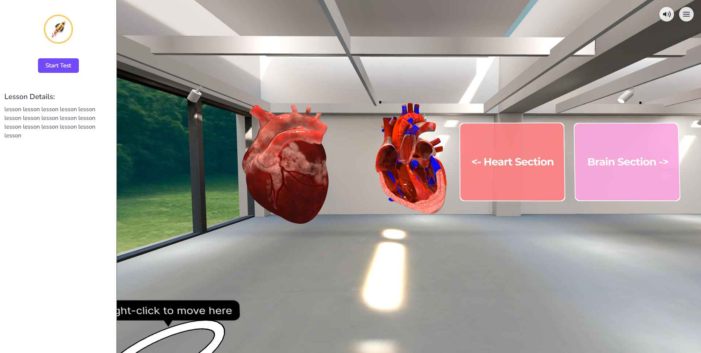
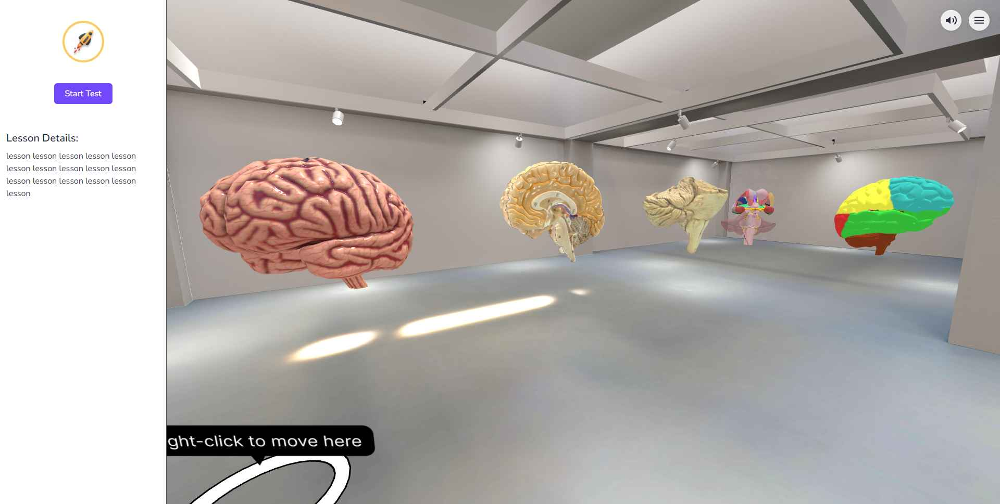
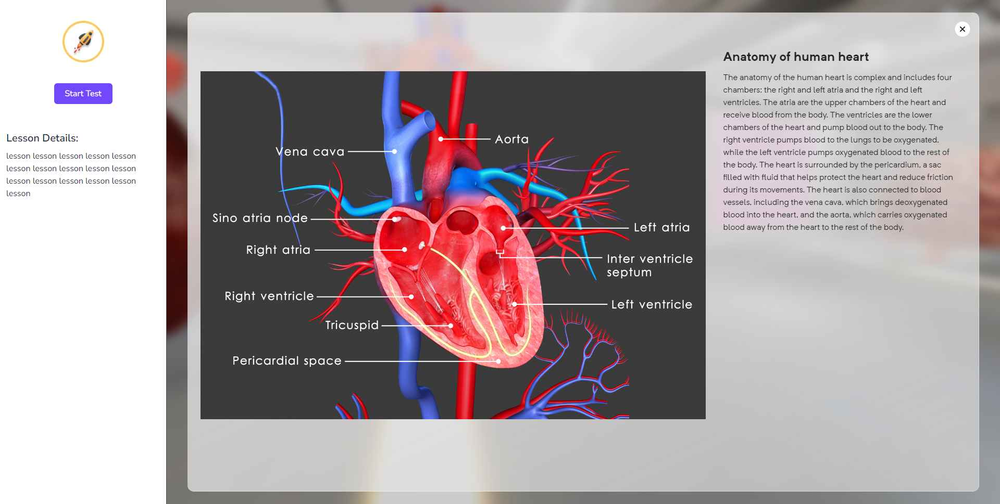
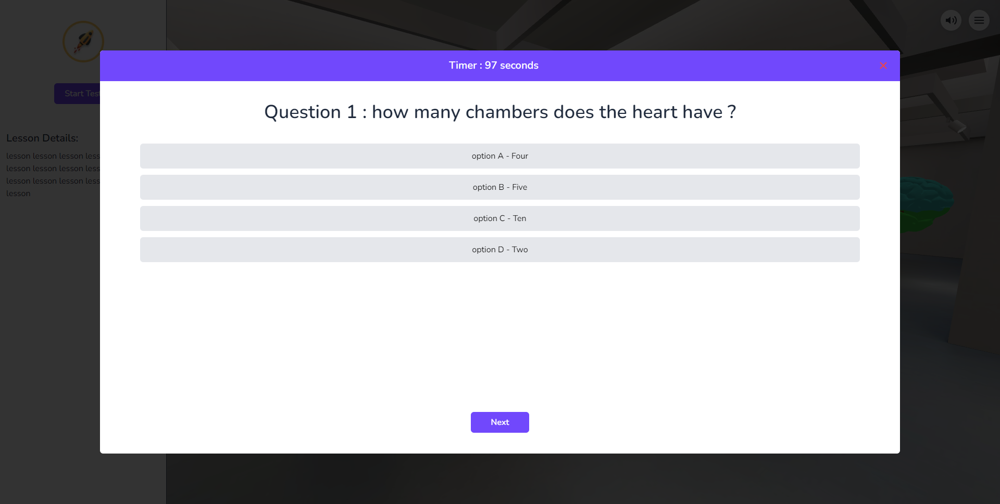
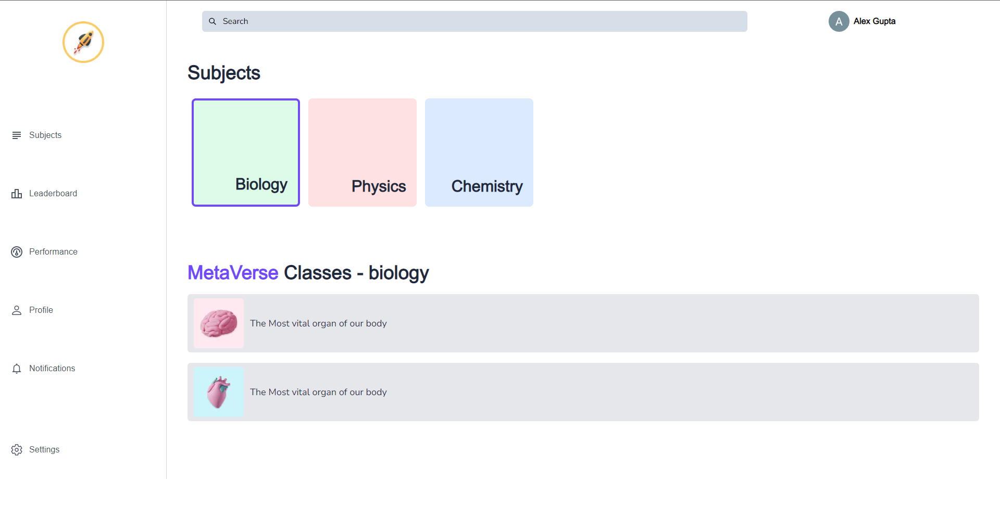

## Science Verse:  A Step into the Future of Science Education: The Metaverse for Engaging and Interactive Learning.

## Problem

Learning Science through traditional methods such as books and YouTube videos can be monotonous and boring for students. These outdated techniques often fail to capture the attention of students and provide limited opportunities for interactive learning, making it challenging for them to grasp new concepts effectively.

## Solution

Introducing an Open-World Metaverse tailored for students, offering a dynamic and interactive learning experience. In this virtual realm, students can roam freely, interact with their educational concepts, and answer multiple-choice questions to reinforce their understanding. Correct answers are rewarded with virtual coins, further motivating students on their learning journey. This innovative solution to education creates a fun and engaging atmosphere for students to learn and grow.